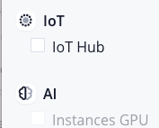
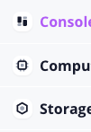
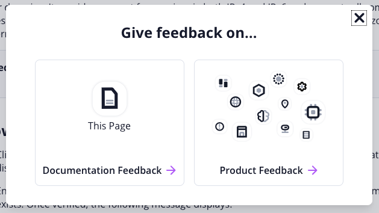

# Contribute to the Documentation Content

## Who can contribute?

Anyone who is a Scaleway employee can contribute to the documentation content.  
However, you will not have the right to push content straight to main.  
All PRs must be validated by at least two technical writers from the Product Documentation Team.

## How to contribute?

All rules below concern this repo.  
Any PRs which do not comply with the rules below will be rejected.

1. Read and follow [the writing guidelines](https://confluence.infra.online.net/display/MARKETTECHANIM/Documentation+Guidelines).
2. Make sure you have identified the type of content that you want to write (eg: is it a how to, a reference content, a tutorial? If you are not sure, refer to the content type definition above).
3. All PRs names must have an associated DOC (formerly MTA) ticket number associated. Please create first a DOC (formerly MTA) ticket.
4. All PRs must have the documentation label associated.
5. All PRs must be reviewed by at least one Technical Writer from the Product Documentation team.
6. All PRs must be approved by at least two Technical Writers from the Product Documentation team before merging to main.
7. When submitting your PR, make sure your final commit message includes `docs($PRODUCTNAME): $FIXEXPLANATION MTA-TICKETNUMBER`

---

## Markdown

Markdown is a lightweight markup language for creating formatted text using a plain-text editor.

Files with markdown content usually use the `.md` extension.

As we need to use evolved dynamic and designed blocks, the choice was to use the extended markdown format , with special `.mdx` extension.

Thoses MDX files could be used with our React components, mixed with traditional markdown content.

## MDX components

MDX components are usefull to set rich content and interactions within your contributions.

### Components details

This section shows code details all listed in a full page.

🔎 [See the full Components page](https://scaleway-docs.s3-website.fr-par.scw.cloud/components/) with code details explained.

Feel free to explore this page in your markdown editor to see how the components were used, or in mdx content files that already use MDX components.

## Frontmatters

Any Markdown file that contains a YAML front matter block will be processed by Gatsby as a special file.  
The front matter must be the first thing in the file and must take the form of valid YAML set between triple-dashed lines.

Here is a common example used in our `.mdx` files:

```markdown
---
title: How to close an account
description: This page explains how to close an account
image: /images/scaleway-account.png
tags: compute baremetal bare metal cloud server dedicated
dates:
  validation: 2021-06-22
  posted: 2020-03-12
steps:
  - step: Configuring the CLI
    url: https://www.scaleway.com/en/docs/compute/bare-metal-cloud/api-cli/bare-metal-with-cli/#-Configuring-the-CLI
  - step: Creating a Bare Metal Server
    url: https://www.scaleway.com/en/docs/compute/bare-metal-cloud/api-cli/bare-metal-with-cli/#-Creating-a-Bare-Metal-Server
  - step: Installing an OS
    url: https://www.scaleway.com/en/docs/compute/bare-metal-cloud/api-cli/bare-metal-with-cli/#-Installing-an-OS/
  - step: Using Other CLI Commands
    url: https://www.scaleway.com/en/docs/compute/bare-metal-cloud/api-cli/bare-metal-with-cli/#-Using-Other-CLI-Commands
---

Here starts the content…
```

- `title` is used as H1 in pages, in html head for browser tab title and for SEO.
- `description` is used in pages and in html head for SEO.
- `image` is used for Hero section image in tutorials pages. Path could be relative to file.
- `tags` are used in within titles in search result lists or pages top.
- `dates` are showed in pages under titles. `validation` must be a date later than the `posted`. Format should be `AAAA-MM-DD`
- `steps` are used in JSON+LD script tag in html head. It respect schema.org format and it used for SEO, as Google could show steps in search results.

---

## Special blocks

There are some blocks that **need to use external files** to work with.

**Take care while editing thoses files !** Follow the rules below.

### ⚙️ Using Header

Header is where top header menu can be edited.

This is a simple `.mdx` file here: `blocks/header.mdx`

- Do not remove frontmatter `blocks: header`
- Edit this file with MDX components `Link` and `GithubLink`.

For instance:

```markdown
---
blocks: header
---

<Link to="/">Doc Home</Link>
<Link to="/tutorials/">Tutorials</Link>
<Link to="/api/">API References</Link>
<Link to="/changelog/">Changelog</Link>
<Link to="/blog/">Blog</Link>
<GithubLink to="/github/">Github</GithubLink>
```

---

### ⚙️ Using Sidebars

Sidebars are located in the **left column** in the layout of a page.

Components are in `Sidebars/`

- `Navbar` is navigation for all pages except tutorials layout.
  - It uses `menu/navigation.json`
- `Filtersbar` is used to filter using Algolia on tutorials page instead of Navbar.
  - It uses `menu/filters.json` to get its content

These files contain common keys:

- `items`: A list of entries. Each `items` entry has a `label`.
- `label`: Displayed to front users in human language.
- `icon`: Displayed to front users for a "Category" (see icons list below).

Some keys are dedicated to `navigation` or `filters`

- navigation
  - `slug`: Always with a `label`, this is the name in the URL
- filters
  - `category`: Facets for Algolia search and results, it can be a product, a user type (like beginner, advanced).
  - `separator`: Used to set distinct blocks in left column. It put a line of separation above it's own list.

#### Icons

Specific icons are used for products.




If you need to add an icon, follow this naming convention: `lowercase-kebab-case.inline.svg`  
In this case, `lowercase-kebab-case` will be the name used as `icon` key in `.json` files.

- ai
- compute
- console
- datacenters
- dedibox
- dedirack
- domain
- iot
- network
- storage

---

### ⚙️ Using CTA

"CTA" is the block used to communicate special marketing offers, like vounchers.


CTA files are located in `blocks/cta/` folder.

#### MDX file

- In `index.mdx` frontmatter always set `blocks` var with `cta` value
- Always use H2 markdown style (i.e. `##`)

Example:

```
---
blocks: cta
---

![][try-tutorial-vouncher.png]

## Try this tutorial on Scaleway Console

With this free 10€ voucher!

[Sign up](https://console.scaleway.com)
```

#### Image

The CTA image accept one unique image.

- Place the only image in `blocks/cta/`, the same folder than `index.mdx`
- The image name is not important, you can choose it

---

### ⚙️ Using Feedback

"Feedback" is a popin that allows users to give us feedback.



#### Typeform urls

1. Go to `blocks/feedback.json`
2. Edit urls for `documentation` and `product`
3. URLs looks like this: _https://example.typeform.com/to/vxE08L_

NOTE:

- "This Page" button sent a feedback for the current page
- The Typeform hidden field param MUST be `this_page`
- This param is set and used by admin/creator of related form
- While the param is correctly set on Typeform admin side, there is nothing more to do for redactors

See [this page about Typeform hidden field](https://help.typeform.com/hc/en-us/articles/360029571951)

---
